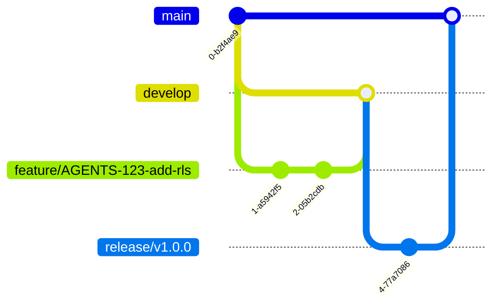

# Agents Guidelines

This document outlines norms for AI/LLM agents (or human contributors) working on the **Riwi Co. Messaging Platform** project.

---

## Branching & Version Control

### Branching Model


### Rules
- **Never work on `main`**:
  - `main` is **immutable** (only for releases).
  - Use `develop` as the base for new branches.
- **Branch Naming**:
  - **Feat**: `feat/description` (e.g., `feat/AGENTS-123-add-rls`).
  - **Fix**: `fix/-description` (e.g., `fix/AGENTS-456-fix-jwt`).
  - **Release**: `release/vX.Y.Z` (from `develop`).
  - **Hotfix**: `hotfix/[JIRA-TICKET]-description` (from `main`).
- **Pull Requests (PRs)**:
  - Target `develop` (unless hotfix → `main`).
  - Require **Human approval** before merge and **passing CI checks**.
  - All branches, expect release branches, are merged via squash merge and deleted.
  - Release branches target main.

---

## Commit Messages
Use **[Conventional Commits](https://www.conventionalcommits.org/)**.
**Format**: `<type>(<scope>): <description>`

| Type       | Usage                          | Example                                  |
|------------|--------------------------------|------------------------------------------|
| `feat`     | New feature                    | `feat(auth): add JWT refresh rotation`   |
| `fix`      | Bug fix                        | `fix(db): correct RLS policy for guests`|
| `docs`     | Documentation                  | `docs: add AGENTS.md norms`               |
| `refactor` | Code refactor (no new features)| `refactor(api): apply SOLID to services`  |
| `test`     | Tests                          | `test(db): add RLS permission test`      |
| `chore`    | Maintenance (e.g., dependencies)| `chore: update PostgreSQL to v15`        |

#### Avoid:
- Vague messages (`fix: stuff`).
- Long descriptions (use PR body for details).

---

## Documentation Norms

### Diagrams > Text/Images
- **Always use Mermaid** for:
  - Architecture.
  - Database schemas.
  - Workflows.
- **Example: ER Diagram**
  ```mermaid
  erDiagram
      rw_user ||--o{ rw_message : sends
      rw_user ||--o{ rw_channel : member_of
      rw_message }|--|| rw_channel : belongs_to
      rw_user {
          uuid rw_id PK
          string rw_username
          string rw_password_hash
          timestamptz rw_created_at
      }
      rw_message {
          uuid rw_id PK
          uuid rw_user_id FK
          uuid rw_channel_id FK
          text rw_content
          boolean rw_is_edited
          timestamptz rw_created_at
      }
  ```

### Code Snippets
- **Short and focused** (≤10 lines).
- **Syntax-highlighted** (use Markdown ```lang).
- **Annotate** non-obvious logic:
  ```sql
  -- RLS Policy: Users can only see messages in their channels
  CREATE POLICY message_access_policy ON rw_message
      USING (rw_channel_id IN (
          SELECT rw_channel_id
          FROM rw_channel_member
          WHERE rw_user_id = current_setting('app.current_user_id')::uuid
      ));
  ```

### Cross-References
- Link to:
  - **External docs**: [PostgreSQL RLS](https://www.postgresql.org/docs/current/ddl-rowsecurity.html).
  - **Internal files**: See [README.md](./README.md#security) for auth details.

---

## Prohibited Actions
| Action | Reason |
|--------|--------|
| Committing to `main`        | Breaks CI/CD pipeline.      |
| Hardcoding secrets          | Use `.env` + `gitignore`.   |
| SQL string concatenation    | Security risk (SQL injection). |
| Bypassing RLS (`BYPASSRLS`) | Violates core security rule.   |
| Physical message deletion   | Audit trail must be preserved.  |

---

## Checklist Before PR
- [ ] Branch follows naming convention.
- [ ] Commit messages are conventional.
- [ ] Mermaid diagrams replace static images/text.
- [ ] No secrets in code (use `.env`).
- [ ] Tests pass locally.
- [ ] Documentation updated (if applicable).

---
**🔗 See Also**:
- [README.md](./README.md) (Project Overview)
- [CONTRIBUTING.md](./CONTRIBUTING.md) (Human Contributor Guide)