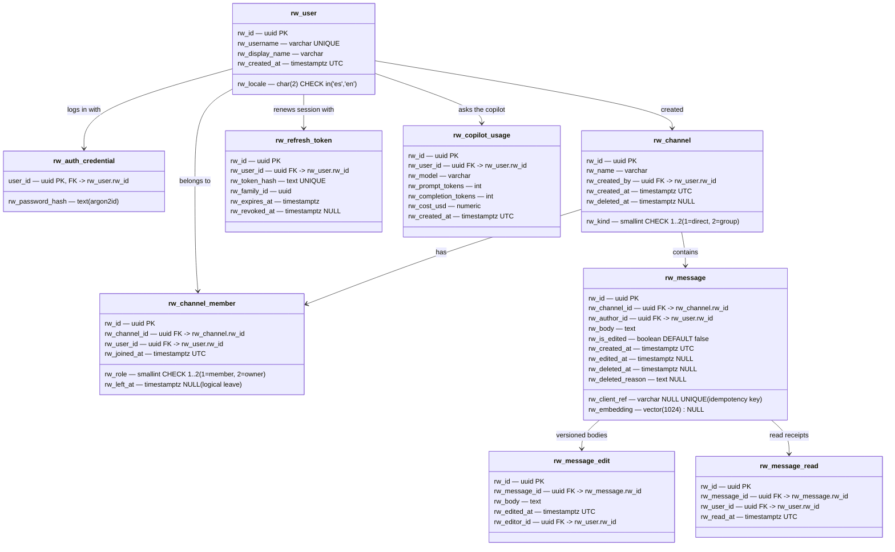
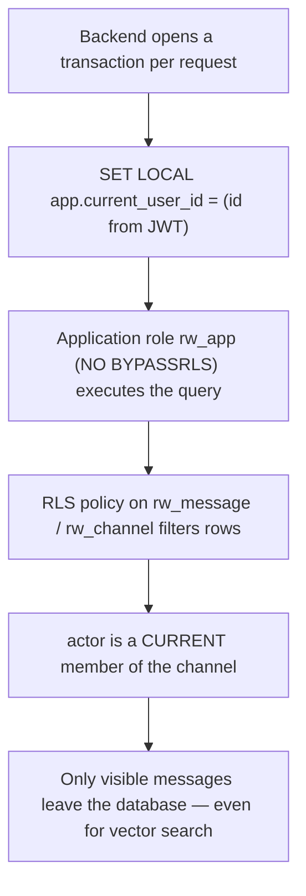
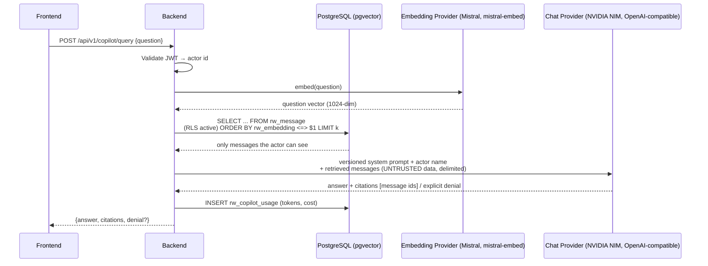
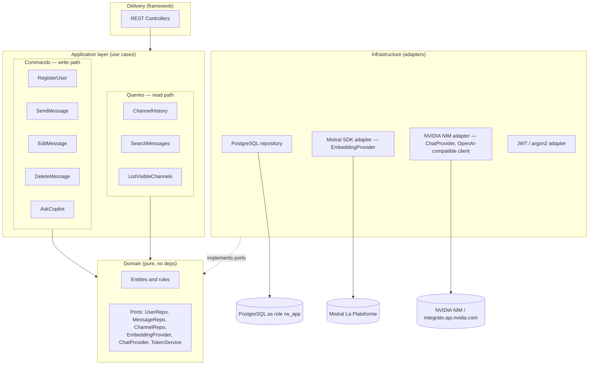
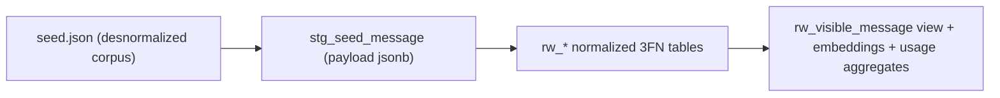

# Riwi Co. — Platform Architecture

Authoritative architecture document for the **Riwi Co. Internal Messaging Platform**, the canonical source of truth that every contribution (backend, database, frontend, AI copilot, deployment) must follow. The decision history and rationale that produced this document are kept in [`DECISIONS.md`](./DECISIONS.md); this document reflects the final decisions and is the contract for implementation.

---

## 1. Goals and guiding principles

The central problem is **confidentiality of conversations**: a user must never see, search, or query messages from channels they are not a member of — not through a direct API call, not through search, not through the AI copilot.

Principles, in order of importance:

1. **The database is the single security boundary.** The visibility rule "the actor is a member of the channel" is enforced by PostgreSQL Row Level Security. The backend, the seed script, and even a DBA with `psql` obey the same policy. There is exactly one place to audit.
2. **Critical logic lives in the database** (transactions, constraints, RLS, functions, procedures, triggers). The backend is a thin dispatcher.
3. **No mirror stores.** Embeddings live inside the RLS-protected table, so semantic search is filtered by the same policy automatically.
4. **Thin use cases, inward-pointing dependencies** (Clean Architecture). The domain does not know the web framework or the DB driver; the two hardest things to swap later (framework, AI provider) are behind ports.
5. **YAGNI where the brief allows it.** No message bus, no event sourcing, no ETL platform — one compose file, one monolith, one static dataset.

---

## 2. Domain model (normalized to 3FN)

### 2.1 From the seed to entities

The desnormalized seed (`seed.json`) repeats users and channels across rows — the "before" evidence for normalization is preserved in the Bronze staging table (§9). Entities identified:

| Entity | Rationale |
|---|---|
| `user` | Aggregate root for an authenticated person: credentials, profile, membership |
| `channel` | Conversation room (group or 1:1); owns messages |
| `channel_member` | User ↔ channel relation with role (`owner` / `member`) and `joined_at` |
| `message` | Atomic message body with author, channel, edit flag, timestamps, logical deletion |
| `message_edit` | Versioned message bodies; chat never destroys evidence, every edit appends a new row |
| `message_read` | Per-user read receipt inside a channel (powers "unread" badges) |
| `auth_credential` | Password hash, separated from the business user |
| `refresh_token` | Hashed token + family for rotation and reuse detection |
| `copilot_usage` | Token / cost audit per request for §11.4 |

### 2.2 Naming and conventions (requirement §2)

- **Database name:** `bd_<nombre>_<apellido>_<clan>` (per assessment brief; the `bd_` prefix is mandatory).
- **Schema inside the database:** `public` (or a dedicated schema if a future hosting target demands it).
- **All tables and columns prefixed with `rw_`** (Riwi) — also per assessment brief.
- **All dates as `timestamptz` in UTC**, `DEFAULT now()`.
- **Deletion is logical only**: `deleted_at` + `deleted_reason` on `rw_message`. Physical `DELETE` is revoked from the application role.
- **Naming:** `snake_case` for tables and columns; `rw_*` prefix on every identifier; primary keys named `rw_id` (UUID), foreign keys `<table>_id`.

### 2.3 Entity–relationship diagram



### 2.4 Keys and indexes

- **Surrogate keys (`uuid`) everywhere.** Justification: the brief asks for `timestamptz` and `uuid` is the safest globally unique, non-leaking identifier across services; natural keys (e.g. email) are kept as `UNIQUE` business keys.
- **Required partial unique index** — a user cannot be an active member of the same channel twice (covers direct-message rooms as well, because the (user, other_user) → channel resolution still goes through `rw_channel_member`):

```sql
CREATE UNIQUE INDEX uq_rw_channel_member_active
ON rw_channel_member (rw_channel_id, rw_user_id)
WHERE rw_left_at IS NULL;
```

- **Required partial unique index for idempotent message delivery** (the frontend's *pending → sent → failed* state machine):

```sql
CREATE UNIQUE INDEX uq_rw_message_client_ref
ON rw_message (rw_author_id, rw_client_ref)
WHERE rw_client_ref IS NOT NULL;
```

- Vector index on `rw_message.rw_embedding` (HNSW) for copilot retrieval; composite index `(rw_channel_id, rw_created_at DESC, rw_id DESC)` backing keyset pagination per channel; index `(rw_user_id, rw_channel_id)` on `rw_message_read` for unread counts.

### 2.5 Design decisions on controversial points

- **Channel membership is the security attribute.** Channels are not "public" / "private" — there is no flag, only membership. Any access rule falls out of `rw_channel_member`. Justification: a flag would force every policy to also check the flag, multiplying ways to leak data.
- **Direct messages are channels of `kind = 1` with exactly two active members.** UI presents them as a 1:1 conversation; storage treats them as a normal channel so RLS, search and copilot all use one rule.
- **One message, many edit versions.** `rw_message` carries the latest body; `rw_message_edit` is the immutable history. The RLS policy on `rw_message_edit` mirrors that on `rw_message`, so editing is also filtered by channel membership.
- **Logical deletion only.** `rw_deleted_at` + `rw_deleted_reason` on `rw_message`; physical `DELETE` is revoked from the application role. The audit trail (who said what, when, and why it was removed) is a hard requirement (see [`AGENTS.md`](../AGENTS.md) prohibited actions).

---

## 3. Security architecture — Row Level Security (requirement §3)



```sql
-- One membership check, reused everywhere:
CREATE POLICY rw_message_visibility ON rw_message
USING (
    EXISTS (
        SELECT 1
        FROM rw_channel_member m
        WHERE m.rw_channel_id  = rw_message.rw_channel_id
          AND m.rw_user_id     = current_setting('app.current_user_id')::uuid
          AND m.rw_left_at IS NULL
    )
);

-- The view required by §3, encapsulates the rule + logical-deletion filter:
CREATE VIEW rw_visible_message AS
SELECT * FROM rw_message WHERE rw_deleted_at IS NULL;
```

Transactional logic in the database:

| Object | Type | Purpose |
|---|---|---|
| `rw_register_user(...)` | Function | Validates input, hashes password (argon2id), creates `rw_user` + `rw_auth_credential` in one transaction. |
| `rw_create_channel(...)` | Function | Creates channel + first `rw_channel_member` (the creator as `owner`) atomically. |
| `rw_send_message(...)` | Function | Inserts message; trigger fills `rw_embedding` from `rw_body` in the same transaction. Idempotent on `rw_client_ref`. |
| `rw_edit_message(...)` | Procedure | Required §3 procedure #1 — appends a `rw_message_edit` row, updates `rw_message.rw_body` / `rw_is_edited`, bumps `rw_edited_at`. Never physical delete. Re-checks the author inside the procedure body because SECURITY DEFINER bypasses RLS (see [`DECISIONS.md`](./DECISIONS.md) § "Phase 7 — `rw_edit_message` author-gate lesson"). |
| `rw_delete_message(...)` | Procedure | Required §3 procedure #2 — logical delete: sets `rw_deleted_at` + `rw_deleted_reason`. The `AND rw_author_id = p_actor_id` clause is the author gate. |
| `rw_add_channel_member(...)` | Function (SECURITY DEFINER) | Phase 3 — owner-only invite. RLS forbids an actor from inserting a `rw_channel_member` row for a different user, so this function runs as the migrator and re-checks the owner invariant in its body. |
| `rw_search_messages(...)`, `rw_unread_count_for_channel(...)`, `rw_mark_channel_read(...)` | Functions (SECURITY DEFINER) | Phase 5 — lexical search + per-channel unread + bulk mark-read. All three re-check membership + GUC actor in their bodies for the same reason. |
| `rw_insert_refresh_token / rw_find_refresh_token / rw_revoke_refresh_token / rw_revoke_refresh_token_family / rw_record_copilot_usage` | Functions (SECURITY DEFINER) | Phase 7 — every read/write against `rw_refresh_token` and `rw_copilot_usage` goes through these functions; the application role has only `EXECUTE` on them (no direct table privileges). Necessary because the login flow runs with `actor_id = None`, which would otherwise be blocked by a pure RLS policy. |
| Trigger `trg_message_embedding_guard` | Trigger | `AFTER INSERT OR UPDATE OF rw_body` on `rw_message` → `RAISE WARNING` if a row landed without an embedding (the seed script and the application send-path can't silently skip the embed step). Renamed from `trg_message_embedding` in Phase 7 to make the guardrail role explicit — the trigger never computes embeddings (no HTTP from PostgreSQL); embeddings are populated by the application layer (`MistralAdapter` on `rw_send_message(...)`) and by `backend/scripts/seed.py`'s post-load embed pass. |
| Trigger `trg_message_read_channel` | Trigger | Phase 7 — `BEFORE INSERT` on `rw_message_read` populates `rw_channel_id` from the referenced `rw_message.rw_channel_id` so the `(rw_user_id, rw_channel_id)` index stays correct without application-side awareness. |

**RLS-enabled tables (current, verified 2026-08-29):**

| Table | RLS | Policy shape | How runtime accesses it |
|---|---|---|---|
| `rw_channel` | enabled | per-user via `rw_channel_member` | direct SQL (read/write inside `RwSession`) |
| `rw_channel_member` | enabled | per-user `rw_user_id = GUC` | direct SQL; cross-user writes go through `rw_add_channel_member` (SECURITY DEFINER) |
| `rw_message` | enabled | per-user via `rw_channel_member` | direct SQL reads; writes via `rw_send_message / rw_edit_message / rw_delete_message` |
| `rw_message_edit` | enabled | per-user via join through `rw_message.rw_channel_id` → `rw_channel_member` | direct SQL read; append-only via `rw_edit_message` |
| `rw_message_read` | enabled | per-user via join through `rw_message.rw_channel_id` → `rw_channel_member` + `rw_user_id = GUC` | direct SQL read + `INSERT ... ON CONFLICT DO NOTHING`; column `rw_channel_id` populated by `trg_message_read_channel` |
| `rw_refresh_token` | enabled (Phase 7) | per-user `rw_user_id = GUC` | **only** via the four SECURITY DEFINER functions (`rw_insert/find/revoke/revoke_family`); runtime role has no table privileges |
| `rw_copilot_usage` | enabled (Phase 7) | per-user `rw_user_id = GUC` | runtime role has only `SELECT` (for the §11.4 summary endpoint); writes via `rw_record_copilot_usage` (SECURITY DEFINER) |

---

## 4. Vector search and the AI copilot — RAG (requirements §4, §8)

### 4.1 Retrieval pipeline



> **Two providers, two ports.** `EmbeddingProvider` and `ChatProvider` (§5.2) are separate interfaces on purpose. Embeddings are pinned to Mistral (`mistral-embed`, 1024 dims) and chat is pinned to NVIDIA NIM (OpenAI-compatible endpoint). Each is still injected via its own port so either can be swapped later without touching use-case code.

### 4.2 Key decisions

- **One chunk = one message** (latest body). The application layer keeps the vector and the content in lockstep — embeddings are filled by `MistralAdapter` on the `rw_send_message(...)` path and by `backend/scripts/seed.py`'s post-load embed pass during seeding. The DB trigger `trg_message_embedding_guard` only `RAISE WARNING`s if a row landed without one; it does not compute embeddings (no HTTP from PostgreSQL). There is no mirror store and nothing to synchronize.
- **No mirror vector database.** The embedding lives in the RLS-protected row, so similarity search is permission-filtered for free, with nothing to leak.
- **Interchangeable provider:** the backend defines separate `EmbeddingProvider` (→ Mistral SDK) and `ChatProvider` (→ NVIDIA NIM via an OpenAI-compatible client) ports. Both are configuration-driven; the use cases depend only on the ports.
- **System prompt versioned** (constant in the repo, logged per request); retrieved messages are wrapped in explicit delimiters and labelled untrusted inside the prompt.
- **Explicit denial taxonomy:** (a) *no membership* — refuse with transparency, never paraphrase a message the actor cannot see; (b) *out of scope* — off-topic refused; (c) *insufficient context* — honest "your visible history does not contain that". Every answer carries **citations to source message ids**.
- **Consumption audit (requirement §11.4):** one insert per call into `rw_copilot_usage`; the accumulated report is a `GROUP BY rw_user_id`.
- **Lexical search with highlight (requirement §11.2):** `ts_headline('spanish'|'english', rw_body, plainto_tsquery($1, $2))` over `rw_message`, under the same RLS policy.

### 4.3 AI providers — current selection (and why)

#### Embeddings — primary

- **Mistral `mistral-embed`** — 1024-dim vectors (verified against [Mistral docs](https://docs.mistral.ai/api/endpoint/embeddings)).
- **Why pinned:** fixed project constraint, free "Experiment" tier on La Plateforme (no card, phone verification, ~1 req/s and a monthly token cap). For a one-shot seed script the cap is irrelevant as long as the seed **batches** many message bodies into one `embeddings.create(inputs=[...])` call instead of one call per row.
- **Fallback:** `nvidia/nemotron-3-embed-1b` if the Mistral free cap is ever exceeded — switch is a config change, no code change.

#### Chat — primary

- **`mistralai/mistral-nemotron`** via the OpenAI-compatible NVIDIA NIM endpoint `https://integrate.api.nvidia.com/v1` (verified to be on the [NVIDIA NIM catalog](https://docs.api.nvidia.com/nim/reference/mistralai-mistral-nemotron)).
- **Why this one:** Mistral model optimized by NVIDIA, multilingual with first-class Spanish support (matches the ES/EN requirement and `ts_headline('spanish'|'english', ...)`), free tier (~40 req/min, no card), good fit for citation-style answers.
- **Why not `meta/llama-3.3-70b-instruct`:** it was the original candidate in [`DECISIONS.md`](./DECISIONS.md) but has been marked for deprecation on **2026-08-25** by NVIDIA (verified on the [model card](https://build.nvidia.com/meta/llama-3_3-70b-instruct)).

#### Chat — fallback

- **`nvidia/nemotron-3.5-lightning-30b-a3b`** (verified on [NVIDIA NIM](https://build.nvidia.com/nvidia/nemotron-3.5-lightning-30b-a3b/modelcard)). Faster, English-optimized; used if the primary is rate-limited or if a live grading session needs lower latency. Same port, same client, configuration-only swap.

---

## 5. Backend architecture (requirement §5)

### 5.1 CQRS — what it is and how it applies

**CQRS (Command Query Responsibility Segregation)** separates operations that *change* state (commands: register user, send / edit / delete message, create channel, join / leave) from operations that *read* state (queries: history, search, copilot context). Full CQRS with two stores and event sourcing is deliberately **rejected** as overkill. Applied pragmatically: one database, but the write path goes exclusively through the transactional DB functions/procedures while the read path goes through the visible view and keyset queries. This is exactly the brief's "thin use cases": use cases contain no business rules — they validate input, dispatch to one side, and map results.

### 5.2 Clean Architecture layers



Only design pattern deliberately applied: **Dependency Injection via constructor-provided ports** (SOLID's D, demonstrable). No Service Locator, no Event Bus — nothing in the brief justifies them.

---

## 6. API contract — REST conventions (requirements §5, §11)

An API **contract** is the explicit agreement between client and server: URLs, methods, status codes, headers, payload shapes — published contract-first as **OpenAPI 3.x (Swagger UI)** docs.

- **Resources are nouns, actions via HTTP verbs**, everything under `/api/v1`; a breaking change ships as `/api/v2` without breaking the shipped app.
- **Status codes:** `200` reads · `201` registration · `204` logical deletion · `400` validation · `401` missing/invalid token · missing-or-invisible messages return **`404`, never `403`** — `403` would leak that a message exists, which is itself confidential.
- **Uniform errors:** RFC 9457 `application/problem+json` envelope everywhere.
- **Correlation ID:** every request gets/accepts `X-Request-Id`, echoed in responses, error bodies and backend logs — a user report maps to exactly one trace.
- **Keyset pagination, never `OFFSET`:** the last-seen row identity is the cursor.

```sql
SELECT ... FROM rw_visible_message
WHERE rw_channel_id = $1
  AND (rw_created_at, rw_id) < ($2::timestamptz, $3::uuid)
ORDER BY rw_created_at DESC, rw_id DESC
LIMIT $4;
```

Response shape: `{ "items": [...], "next_cursor": {"created_at": ..., "id": ...}, "has_more": bool }`. `OFFSET` scans and discards N rows per page and skips/repeats rows when the list mutates between pages — keyset is stable under real-time delivery.

- **Idempotent send:** the client-generated `rw_client_ref` is `UNIQUE`; retrying a submission returns `409` (or the original record) instead of a duplicate — this backs the frontend's *pending → sent → failed* state machine.
- **Forbidden (invalidating conditions):** physical deletes, SQL string concatenation (everything parameterized), `OFFSET`, `BYPASSRLS`.

### Endpoint surface

| Method & path | Status | Purpose |
|---|---|---|
| `POST /api/v1/auth/register` · `POST /api/v1/auth/login` · `POST /api/v1/auth/refresh` | shipped | Sessions (register, JWT, refresh rotation) |
| `GET /api/v1/me` | shipped | Minimal actor echo for JWT-middleware BDD tests |
| `PATCH /api/v1/me` | **planned** (issue #26) | Profile / locale persistence — frontend already writes the chosen locale to `localStorage` and `TODO`s a server-side `PATCH /api/v1/me` call; without this endpoint the choice is lost across sessions |
| `GET /api/v1/channels` | shipped | Visible conversations (RLS-filtered) — **no `?cursor`/`?limit` pagination yet** (issue #27); returns the full list |
| `POST /api/v1/channels/group` · `POST /api/v1/channels/direct` · `POST /api/v1/channels/{id}/members` · `DELETE /api/v1/channels/{id}` | shipped | Create channel / add member / leave |
| `GET /api/v1/channels/{id}/messages?cursor_ts=&cursor_id=&limit=` | shipped | Channel history, keyset (§11.1) |
| `POST /api/v1/channels/{id}/messages` | shipped | Send message (transactional function, idempotent on `rw_client_ref`) |
| `PATCH /api/v1/messages/{id}` · `POST /api/v1/messages/{id}/delete` | shipped | Edit / logical delete (procedures). Non-author attempts return **404** (no existence leak), not 403. |
| `POST /api/v1/messages/{id}/read` | shipped | Mark read receipt |
| `GET /api/v1/channels/{id}/search?q=&limit=` | shipped (channel-scoped, not cross-channel) | Message search with `ts_headline` highlight (§11.2). The original brief's `GET /api/v1/messages/search?q=` was deliberately scoped to a single channel — see [`DECISIONS.md`](./DECISIONS.md) for the rationale (avoids the cross-channel search disclosure risk). |
| `POST /api/v1/copilot/query` | shipped | RAG answer + citations (§11.3) |
| `GET /api/v1/copilot/usage` | shipped | Accumulated consumption per user (§11.4) |

---

## 7. Authentication and authorization (requirement §6)

- Passwords hashed with **argon2id** (bcrypt acceptable as fallback) in `rw_auth_credential`. Plaintext passwords invalidate the project.
- **Access JWT**, short-lived (~15 min), carrying `sub = user_id`. Channel membership is resolved from the database per transaction, not trusted from any claim — tokens are stateless and a membership change must not wait for token expiry.
- **Refresh token rotation**: each refresh issues a new pair and revokes the previous one; tokens stored **hashed** in `rw_refresh_token` with a `rw_family_id`; presenting an already-revoked token revokes the whole family (reuse/theft detection) — pattern verified against [Auth0 refresh token rotation docs](https://auth0.com/docs/secure/tokens/refresh-tokens/refresh-token-rotation).
- **Actor propagation**: middleware extracts `sub` → opens the transaction → `SET LOCAL app.current_user_id` → the whole request (including RAG retrieval) executes as that actor. **The user id is never taken from the request body** (invalidating condition).

---

## 8. Frontend architecture (requirement §7)

- **Three required zones:** conversations list · copilot panel · user profile — laid out side-by-side on desktop, stacked on mobile (responsive breakpoints).
- **Send state machine** *pending → sent → failed* built around the idempotent `rw_client_ref`; retries are safe by contract.
- **Lazy history**: `IntersectionObserver` (or `react-infinite-scroll-component`, which is React 19 compatible and ~4 kB gzipped) triggers the next keyset fetch; the list never remounts (scroll position preserved); explicit *loading / empty / error* states.
- **i18n**: ICU message files (`es.json`, `en.json`) loaded via `react-i18next`; **zero strings inside components** — language switcher writes to the auth profile (`rw_user.rw_locale`).
- **Unread tracking:** `rw_message_read` rows power per-channel badges; the WebSocket / polling layer keeps them in sync without re-fetching history.
- **No obfuscation, no blurring:** messages the actor cannot see are never returned by the API, so the UI never renders them. Justification: obfuscation still ships content to the client — one wrong filter and a private conversation is exposed. Server-side exclusion is the only airtight option.

---

## 9. Data engineering — seed and Bronze staging

**Medallion** layering — applied at minimal scale because this is a one-shot load, not a streaming pipeline. **Bronze** stores the seed as received (auditable, immutable) → **Silver** is the cleaned/normalized 3FN model → **Gold** is consumption-oriented read structures (`rw_visible_message` view + embeddings + usage aggregates).



Even for a one-shot load, Bronze keeps the corpus exactly as delivered — the "before" data for the 1FN→3FN write-up — and makes the Silver load re-runnable.

**ETL tools considered:** Apache Airflow, dbt, Talend / Pentaho, Azure Data Factory / AWS Glue, Airbyte / Fivetran. **Chosen: none** — a single Python script (`psycopg`, parameterized inserts, never concatenation) as a disposable `seed` compose service. The corpus is one static JSON file; an ETL platform adds containers and credentials without buying repeatability that `docker compose run seed` doesn't already give.

---

## 10. Quality assurance — BDD (requirement §9)

**BDD (Behavior-Driven Development)** writes tests in business language — *Given / When / Then* (Gherkin) — so the scenario itself is readable proof that the security rule works. The two mandatory tests as executable specifications:

```gherkin
Feature: Visible messages by channel membership
  Scenario: Non-member cannot see a private channel's messages
    Given user "Valentina" who is not a member of channel "Camila-private"
    And a message sent in "Camila-private" by user "Camila"
    When Valentina requests the channel history, a messages search, or asks the copilot
    Then the message does not appear in any of the three channels

  Scenario: A member always sees their own channel's messages
    Given user "Valentina" who is a member of channel "team-1"
    And a message sent in "team-1" by Valentina herself
    When Valentina requests the channel history
    Then her message is present despite any later role changes
```

Executed with **pytest + pytest-bdd** against a **real PostgreSQL spawned by testcontainers**; each scenario sets `app.current_user_id` per actor, mirroring the manual `psql` verification the brief recommends doing first.

---

## 11. Deployment and infrastructure (requirement §10)

Two separate concerns, two separate topologies: **local/graded environment** (must boot from `docker compose up` alone, per the brief) and **production environment** (built around a $0 budget — see §11.1).

```yaml
services:
  db:        # pgvector/pgvector:pg18 (PostgreSQL 18 + pgvector 0.8.x) with healthcheck
  migrate:   # applies DDL/functions/RLS once (depends_on db healthy, restart: "no")
  seed:      # medallion load: bronze -> silver (restart: "no")
  backend:   # API, depends_on migrate completed_successfully
  frontend:  # static build served by nginx
```

- `docker compose up` brings up **db + migrate + seed + backend + frontend** (5 services; `migrate` and `seed` exit after success and are gated by `completed_successfully`).
- One documented command applies migrations and loads the full corpus: `docker compose run migrate && docker compose run seed` (both are idempotent).
- `.env.example` ships with placeholders only — no real secrets. The project must boot on a clean machine from the README alone.
- This local stack is unchanged in shape from the original proposal; only the Postgres image tag moves from `pg15` to `pg18` (§12).

### 11.1 Production topology on a $0 budget

The original VPS + Caddy plan assumed a small recurring spend. With a hard $0 budget, it is replaced by three free managed services instead of one paid box — each with a real (not trial) free tier as of 2026:

| Concern | Service | Why this one | Caveat to design around |
|---|---|---|---|
| Database | **Neon** (Supabase as equal alternative) | Real, unmodified PostgreSQL with a **permanent** free tier (no card, no expiry) — full support for custom roles, `CREATE POLICY`, `SET LOCAL`, functions/procedures/triggers, and pgvector. Nothing in §3's RLS design has to change. | Free tier is single-region, shared compute, ~0.5–3 GB storage — comfortably enough for one static corpus. Use the **pooled** connection string in **transaction mode**, and keep `SET LOCAL app.current_user_id` inside the same transaction as the query it protects (it already is, per §7) so pooling never separates the two. |
| Backend (API) | **Render** free Web Service, deployed from the same backend `Dockerfile` | No card required; gives a real HTTPS URL with zero reverse-proxy config, replacing Caddy entirely. | Free web services spin down after 15 min idle and cold-start in ~30–60s on the next request — acceptable for an academic / demo audience; mitigate with a free uptime pinger if a live grading session needs to avoid the cold start. |
| Frontend | **Render Static Site** (Vercel / Netlify are equally valid) | Static hosting has no spin-down and is free indefinitely. | None of note. |
| Migrate / seed | Same `migrate` and `seed` containers, run **once** with `--env-file .env.prod` pointed at the Neon/Supabase connection string | They only need a Postgres URL — no code changes between "local Postgres in Compose" and "remote Postgres on Neon." | Run this from a dev machine or a Render one-off Job; there is no scheduler dependency since the corpus is static (§9). |
| Backups | Neon's / Supabase's built-in point-in-time recovery on the free tier (shorter retention than a paid tier) | Zero extra cost vs. the original nightly `pg_dump` cron | For anything beyond course-project stakes, a scripted `pg_dump` to object storage is still the more durable answer — kept as the fallback below. |

**Fallback:** if a small budget ever does appear, the original single-VPS + Docker Compose + Caddy plan (with nightly `pg_dump`) is still the better production shape — it removes the cold-start trade-off and the multi-vendor moving parts. Treat §11.1 as the $0 default and the VPS plan as the upgrade path, not the other way around.

---

## 12. Technology stack

| Layer | Proposed | Rationale | Fallback |
|---|---|---|---|
| Language | **Python 3.13** | One clear step up from 3.12 with a fully-settled ecosystem (FastAPI, Pydantic v2, psycopg 3, testcontainers all first-class). Python 3.14 is out, but its free-threading / deferred-annotation changes are still being validated across third-party packages — not worth the risk for a graded project. | TypeScript (Node 24 LTS) if that is the team's known stack |
| Backend framework | **FastAPI** (current 0.12x line) | Auto-generated OpenAPI 3.x docs, async, DI built-in. Validated against [`fastapi-rls`](https://fastapi-rls.com/docs/installation) compatibility (Python 3.10–3.13). | NestJS / Spring Boot |
| DB driver | **psycopg 3** (3.2.x, no ORM for business paths) | The brief demands SQL-first; an ORM would hide the functions / RLS that carry the points. | SQLAlchemy Core for reads only |
| Database | **PostgreSQL 18** via `pgvector/pgvector:pg18` image (pgvector 0.8.x) | PG18 is the current stable major (PG19 is still in beta); pgvector 0.8.x adds iterative index scans and parallel HNSW builds over the 0.5.x line assumed originally. Satisfies the brief's `PostgreSQL 15+` requirement with headroom. | PostgreSQL 17 if a managed host's extension allow-list hasn't caught up to 18 yet |
| **Embeddings** | **Mistral `mistral-embed`** — 1024 dims (`vector(1024)`, §2.3) | **Fixed constraint.** Free "Experiment" tier on La Plateforme: no card, phone verification, ~1 req/s and a monthly token cap — for a one-shot static corpus this is trivial as long as the seed script **batches** many message bodies into one `embeddings.create(inputs=[...])` call. | `nvidia/nemotron-3-embed-1b` if the Mistral free cap is ever exceeded — config-only swap |
| **LLM / chat** | **NVIDIA NIM**, `mistralai/mistral-nemotron` via the OpenAI-compatible endpoint `https://integrate.api.nvidia.com/v1` | **Fixed constraint.** Mistral model optimized by NVIDIA; multilingual (first-class Spanish support for ES/EN requirement + `ts_headline`); free tier (no card, ~40 req/min); citation-style answers. Replaces `meta/llama-3.3-70b-instruct` (deprecated 2026-08-25 per the [model card](https://build.nvidia.com/meta/llama-3_3-70b-instruct)). | `nvidia/nemotron-3.5-lightning-30b-a3b` if the primary is rate-limited — config-only swap, no code change |
| Retrieval | **pgvector cosine (`<=>`) + HNSW index**, lexical fallback `ts_headline` | No extra infra; RLS applies for free | Hybrid rank fusion if quality demands |
| Frontend | **React 19.2 + TypeScript 7.x + Vite 7.x** | React 19 is the current major (Actions, `use`, Server Components stable); Vite 7.x + TS 7.x is the combination the `react-typescript-modern` skill ships; **`typescript-eslint` peer deps currently cap at TS `<6.1.0`** ([typescript-eslint#12518](https://github.com/typescript-eslint/typescript-eslint/issues/12518)), so a project that adds ESLint must either pin TS 6.x or skip the linter until `typescript-eslint` catches up — flag this in the CI workflow decision. Build tooling floor: Node 22.22+ (current Active LTS as of 2026-08). The shipped frontend is a hand-rolled fetch + state + `react-i18next` single-page app (three-pane layout in `frontend/src/App.tsx`; see `.agents/skills/react-typescript-modern` for the banner explaining why the React skill is generic, not project-specific). `react-infinite-scroll-component` (IntersectionObserver, ~4 kB gzipped, React 19 compatible) handles the lazy keyset history. | Angular if more familiar |
| i18n | **react-i18next 17.x** (i18next 26.x) with `es.json` / `en.json` files | Requirement: zero hardcoded strings; the locale lives on `rw_user.rw_locale` | FormatJS |
| Testing | **pytest 9.x + pytest-bdd + testcontainers-python 4.x** | Two BDD scenarios against a real PostgreSQL (the brief's mandate); pin the `pgvector/pgvector:pg18` image in the testcontainers fixture so tests exercise the real extension version used in prod | vitest + supertest (if TS) |
| Containerization | **Docker Compose** (5 services, §11) | Brief requirement; base images bumped to `python:3.13-slim` and `node:24-alpine` | — |
| Production infra | **Free-tier composition: Render (backend + static frontend) + Neon/Supabase (Postgres+pgvector)** — see §11.1 | Replaces the VPS given the $0 budget; each piece has a genuine no-card free tier in 2026 | Single VPS + Compose + Caddy, once/if a small budget exists (see §11.1) |
| Secrets | `.env` + `.env.example` placeholders; **no real keys in git** | Invalidating-condition hygiene | — |

---

## 13. Requirements traceability

| Requirement | Where it is decided |
|---|---|
| §1 Normalization 3FN | §2 model + Bronze staging as "before" evidence |
| §2 DDL | §2.2 conventions + §2.4 indexes (two partial unique indexes) |
| §3 DB logic | §3 RLS policy, role `rw_app`, visible view, transactional function, 2 procedures |
| §4 Search / RAG security | §4 per-row embedding + trigger, RLS-filtered vector scan, keyset, no physical deletes |
| §5 Backend | §5 Clean Architecture + pragmatic CQRS; §6 keyset / RFC 9457 / correlation ID |
| §6 Auth | §7 argon2id, short JWT, rotating revocable refresh with family, `app.current_user_id` |
| §7 Frontend | §8 three zones, pending/sent/failed, lazy keyset, i18n, server-side exclusion |
| §8 Copilot | §4.2 citations, denial taxonomy, versioned prompt, provider port |
| §9 QA | §10 two BDD scenarios vs real PostgreSQL (testcontainers) |
| §10 Deploy | §11 compose, one migrate+seed command, clean-machine README |
| §11 Queries | §6 endpoint table: keyset history, `ts_headline` search, RAG context SQL, usage `GROUP BY` |

---

*Narrative trade-offs and runtime decisions are recorded in [`DECISIONS.md`](./DECISIONS.md). The mermaid conventions and the prohibited-actions list (no `BYPASSRLS`, no SQL concatenation, no physical message deletion, no commits to `main`) come from [`AGENTS.md`](../AGENTS.md).*